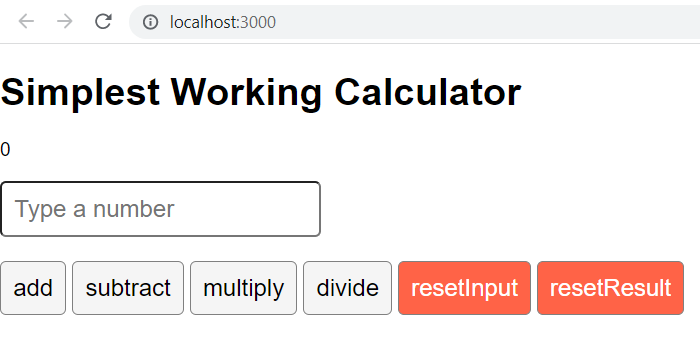

# Simplest Working React Calculator

This is a simple toy project made in react for the final project of the course "React Basics", 5th course of "Meta Front-End Developer Professional Certificate".

Install dipendencies:
`npm install`  

Execute the project:  
`npm start`  

